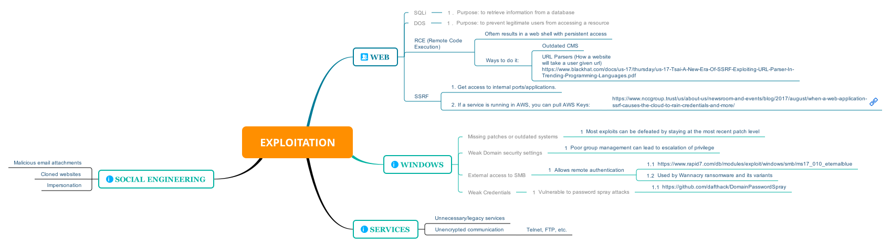

**Summary**

This is a simple markdown info on how exploitation should be done when doing a pentest. This markdown will cover the tools and vectors used in the exploitation stage.

**Exploitation Steps**

The exploitation stage involves using a program or tool to exploit a vulnerability identified during the scanning stage. Most often, these exploits will be downloaded from a repository and/or used by a well known software tool.

You can also download this map from the resources directory [here](../resources/Exploitation.svg).

Following sections will contain a breakdown of each node in the map. These sections will link programs/softwares that help with this stage.

**Web**
1. **Common**
	* SQLi refers to SQL injection. This can be used on forms that pass user submitted data to a database query. Tools for this exploit include Burp, SQLmap, and many more.
	* DOS refers to denial of service. This exploit overwhelms an application/system with data.
2. **Remote Code Execution**
	* Often results in a web shell with persistent access
	* Can be caused by arbitrary file uploads, outdated CMS, or URL parsers
3. **SSRF**
	* Allows access to internal ports/applications
	* https://www.blackhat.com/docs/us-17/thursday/us-17-Tsai-A-New-Era-Of-SSRF-Exploiting-URL-Parser-In-Trending-Programming-Languages.pdf

**Windows**
1. * Missing Patches or outdated systems
2. * Weak domain security settings*
	*https://github.com/BloodHoundAD/BloodHound
3. * External access to SMB*
	* Allows for remote authentication
	* Used by WannaCry ransomware and its variants
	* https://www.rapid7.com/db/modules/exploit/windows/smb/ms17_010_eternalblue
4. *Weak Credentials*
	* Exploitable by password spray attacks
	* https://github.com/dafthack/DomainPasswordSpray

**Services**
1. * Unneccesary or legacy Services
2. * Unencrypted communication: ftp, telnet, etc.

**Social Engineering**
1. * Malicious email attachments*
	* Very common vector for getting initial code exec on the target network*
2. * Phishing with cloned websites or logins*
	* Common vector for credential Phishing*
3. * Impersonation*
