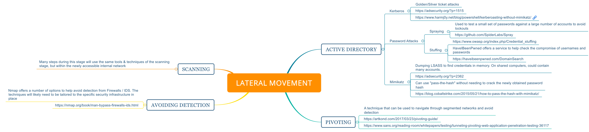

**Summary**

This is a simple markdown with info on how to perform lateral movement during a Penetration Test. This markdown will cover the tools and vectors used in the this stage.

**Lateral Movement steps**

This stage's goal is to move across the systems on a network with the possible goals of reaching a target system or subnet, obtaining credentials for a network administrator, or simply to gain control of as many systems as possible.

You can also download this map from the resources directory [here](../resources/lateral_movement.svg).

The following sections will contain a breakdown of each node in the map. These sections will link programs/software/guides that help with this stage.

**Active Directory**
1. **Kerberos**
	* Golden/Silver ticket attacks
	* https://adsecurity.org/?p=1515
	* https://www.harmj0y.net/blog/powershell/kerberoasting-without-mimikatz/
2. **Password Attacks**
	* Password spraying is used to test a small set of passwords against a large number of accounts to avoid lockouts
	* https://github.com/SpiderLabs/Spray
	* Password stuffing uses compromised credentials from large data breaches against other Services
	* https://www.owasp.org/index.php/Credential_stuffing
	* HaveIBeenPwned offers a service to help check the compromise of usernames and passwords
	* https://haveibeenpwned.com/DomainSearch
3. **Mimikatz**
	* Dumping LSASS to find credentials in memory. On shared computers, could contain many accounts.
	* https://adsecurity.org/?p=2362
	* Can use "pass-the-hash" without needing to crack the newly obtained password hash
	* https://blog.cobaltstrike.com/2015/05/21/how-to-pass-the-hash-with-mimikatz/

**Pivoting**
* A technique that can be used to navigate through segmented networks and avoid detection
* https://artkond.com/2017/03/23/pivoting-guide/
* https://www.sans.org/reading-room/whitepapers/testing/tunneling-pivoting-web-application-penetration-testing-36117

**Scanning**
* Many steps during this stage will use the same tools & techniques of the scanning stage, but within the newly accessible internal network

**Avoiding Detection**
* Nmap offers a number of options to help avoid detection from Firewalls / IDS. The techniques will likely need to be tailored to the specific security infrastructure in place
* https://nmap.org/book/man-bypass-firewalls-ids.html
